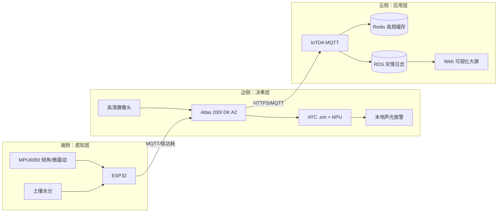
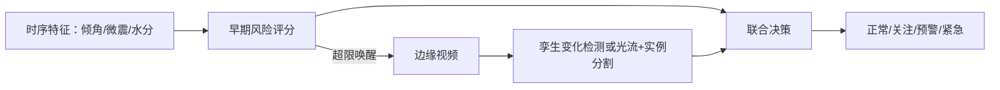

# “智卫防灾”——基于昇腾与边缘计算的地质灾害多模态早期预警系统

> 赛题：基于华为云产品打造 AI 创新应用  
> 文档定位：竞赛评审技术报告 / 开发与部署指南  
> 核心关键词：低成本、断网可用、分级唤醒、昇腾 NPU、云边端协同

## 1. 项目简介（Project Overview）

“智卫防灾”面向偏远山区泥石流、塌方和边坡失稳场景，采用 ESP32 低功耗传感器、昇腾边缘计算与华为云 IoTDA/RDS/Redis 构成端-边-云闭环。系统不依赖持续公网连接：端侧持续采集倾角、微震动与土壤水分，边侧对异常趋势进行毫秒级判断并在本地触发声光报警；网络恢复后再将事件与视频证据同步到云端。

项目体现华为云产品价值：IoTDA 负责设备安全接入和 MQTT 消息管理，Redis 承担高频实时状态缓存，RDS 沉淀告警、灾情与模型依据，云端大屏实现趋势和多站点联动；CodeArts 码道代码智能体贯穿需求理解、代码生成、测试和缺陷修复，形成“想法到应用”的工程化路径。

## 2. 痛点分析与解题思路（Problem Statement & Approach）

### 2.1 痛点

- 真实灾害样本稀缺，纯监督训练难覆盖多雨强、坡度和失稳阶段。
- 偏远山区网络和电力不稳定，云端单点决策存在告警延迟与失联风险。
- 传统摄像头持续上传成本高、隐私和功耗压力大；只用阈值又容易误报。

### 2.2 解题思路

1. **物理沙盘数据仿真**：自建可调坡度沙盘，控制降雨强度、含水率和加载过程，采集真实 MPU6050/水分传感器时序，并同步摄像头画面，形成可回放、可标注的数据集。
2. **多模态分级唤醒**：ESP32 负责低功耗常态监测和“提前吹哨”；只有倾角、微震动或含水率组合超限时，才唤醒昇腾板进行视觉复核。
3. **面向变化而非目标检测**：采用双时态变化检测孪生网络；资源受限时使用光流+实例分割，重点识别坡面纹理位移、裂缝扩展、落石和泥流动态，减少“检测到物体但未发生灾害”的误报。
4. **云边端协同**：边缘端提供断网可用和声光闭环，云端负责历史趋势、跨站点关联和评审大屏。

## 3. 系统架构设计（System Architecture）

### 3.1 三层职责

| 层级 | 组件 | 职责与故障边界 |
|---|---|---|
| 端 | ESP32、MPU6050、水分传感器 | 采样、时间戳、滑动统计、低功耗；无公网时独立运行 |
| 边 | Atlas 200I DK A2、摄像头 | 接收唤醒、NPU 推理、视频复核、声光报警、断网缓存 |
| 云 | IoTDA、Redis、RDS、大屏 | 设备接入、实时态势、审计留痕、趋势研判与演示 |

## 4. 核心功能实现（Core Implementation）

### 4.1 数据管线与沙盘采集

沙盘采集协议统一使用 `sample_id、timestamp、sensor_id、tilt_deg、vibration_rms、soil_moisture、rain_level、label`。每次实验记录降雨阶段、坡体材料、载荷和摄像头视角；以事件窗口切分训练/验证集，避免同一次实验泄漏到不同集合。沙盘数据不只是演示素材，而是可重复生成的领域数据资产。

### 4.2 双模态 AI 算法方案

- 时序侧：提取倾角变化率、震动 RMS、含水率增长率及多传感器相互印证关系；采用阈值+轻量时序分类器，优先保证召回率。
- 视觉侧：双时态孪生网络输入灾前/当前帧，计算特征差异图并定位微小位移；没有足够算力时采用光流估计运动场，再用实例分割区分泥流、落石与植被摆动。
- 联合规则：`时序高风险 AND 视觉变化显著` 触发紧急；仅时序高风险进入关注并继续采样；视觉不支持时保持本地告警并上送“待复核”。工程上以“低误报+可解释”为目标，不宣称绝对零误报。

### 4.3 昇腾 ATC 模型部署

1. 在训练环境导出 ONNX，固定输入尺寸、颜色空间和归一化参数。
2. 使用 ATC 将 ONNX 转换为昇腾 `.om`，配置 `soc_version`、动态批量策略和输出节点。
3. 在 Atlas 上通过 ACL/昇腾推理接口加载 `.om`，预处理、NPU 推理和后处理均采用异步队列。
4. 以沙盘回放集进行精度、延迟和温升测试；将模型版本、阈值和校准参数写入 RDS。

## 5. 华为云服务集成方案（Huawei Cloud Integration）

### 5.1 IoTDA

- 为每个 ESP32 建立设备身份、产品模型和 MQTT 主题；设备上报属性包含 `tilt、vibration、soil_moisture、battery、edge_status`。
- 采用 TLS、设备密钥和 Topic ACL；云规则将设备消息路由到 Redis 与 RDS。
- 断网恢复时，边缘按时间顺序补传事件摘要；IoTDA 负责设备在线状态和消息接入治理。

### 5.2 Redis

- 保存秒级或更高频率的最新传感器窗口：`sensor:{site_id}:{device_id}:latest`。
- 保存边缘在线、最后心跳、风险分数及去重键；设置 TTL，避免缓存膨胀。
- 为大屏提供低延迟查询，避免频繁扫描 RDS。

### 5.3 RDS

- 建议表：`device`、`sensor_event`、`alarm_event`、`model_evidence`、`deployment_audit`。
- 持久化告警等级、传感器快照、图片/视频对象地址、模型版本、处置人和关闭原因，支持按站点、时间和等级检索。
- 仅存摘要和审计证据，原始视频按策略存储；生产环境启用备份、最小权限账号和审计日志。

### 5.4 可视化大屏

大屏展示地图/站点状态、坡体风险颜色、实时曲线、告警时间线和模型证据；Redis 驱动实时卡片，RDS 驱动历史回放。演示模式提供沙盘实验回放，清晰呈现“传感器超限 -> 边缘唤醒 -> NPU 复核 -> 云端留档”的完整链路。

## 6. CodeArts 应用实践（CodeArts Practice）

CodeArts 码道代码智能体是本项目的必选研发辅助工具，按“需求理解-生成-验证-修复”闭环使用：

- **需求理解**：将赛题表格、传感器字段和接口约束转换为模块清单、Topic 规范、数据字典和验收用例。
- **代码生成**：生成 ESP32 的 MPU6050/水分采集脚本、MQTT 上报与断线重连；生成云端 IoTDA 消息解析、Redis 缓存、RDS DAO 和大屏接口。
- **问题修复**：针对串口时序、MQTT 重连、JSON 字段漂移、ATC 输出维度不匹配等问题，提供根因分析、最小补丁和回归测试建议。
- **质量门禁**：将智能体输出纳入 CodeArts 仓库、流水线、静态扫描和人工评审，禁止未经测试的代码直接进入演示环境。

提效价值体现在：减少样板代码编写，统一设备协议和异常处理，加快从沙盘验证到云端 Demo 的迭代；关键算法、阈值和安全策略仍由团队验证并负责。

## 7. 快速部署与开源指南（Deployment Guide）

### 7.1 五步部署

1. **端侧**：烧录 ESP32 固件，配置设备证书、采样周期、站点 ID 和边缘网关地址。
2. **边侧**：安装 Atlas 驱动与 CANN/ACL 运行时，放置 `.om` 模型、摄像头和声光报警参数。
3. **云侧**：创建 IoTDA 产品/设备、Redis、RDS 实例，导入表结构和最小权限账号。
4. **应用**：部署数据接入服务与 Web 大屏，配置 IoTDA 规则路由、告警阈值和站点地图。
5. **验证**：用沙盘回放执行正常、裂缝、滑移、泥流、断网五类用例，检查本地报警、补传和云端审计。

### 7.2 开源交付建议

仓库建议包含 `firmware/`、`edge-atlas/`、`cloud-service/`、`dashboard/`、`models/`、`deploy/`、`docs/`；提供依赖锁定文件、环境变量模板、RDS 初始化 SQL、IoTDA 产品模型、模型转换命令、部署手册、开源许可证和演示视频/截图。严禁提交设备密钥、云账号、真实地理坐标和未经授权的灾情影像。

### 7.3 社会价值与成本优势

ESP32 与通用传感器构成低成本采集节点，昇腾板仅在风险窗口被唤醒，减少持续视频传输与云推理费用；断网声光报警提升山区生存性。系统可先在校园、矿区、乡村道路和水库边坡小规模布设，再通过 IoTDA 多设备接入和 RDS 审计扩展为区域化监测网络。
